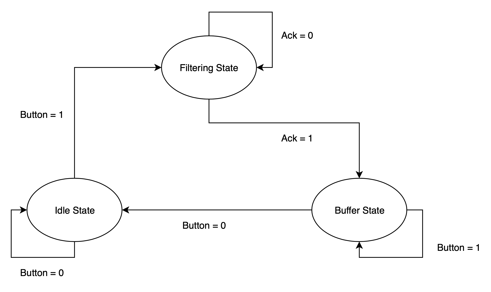
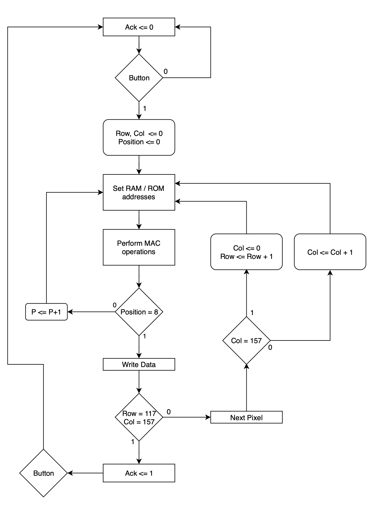

# Digital-Image-Filtering-VHDL
A VHDL description of a digital image filtering system on FPGAs

## Problem Statement

Design an image filter in VHDL that uses a 3x3 sliding window for QQVGA size images, with 8-bit pixel resolution. 

Use a Read-Write Memory module (RWM, more popularly known as RAM or Random- Access Memory) to store the original image as well as the filtered image and a Read Only Memory module (ROM) to store the filter coefficients. The coefficient memory should hold two sets of coefficients - one for a smoothening filter and one for a sharpening filter.

An external switch indicates whether the image is to be smoothened or sharpened. A push- button is used to start the filtering operation. After constructing the filtered image, the system waits for next pressing of the push-button.

## Solution

The system is divided into three stated: 
1. **Idle state** - Where the system waits for user to press button 
2. **Buffer state** - Where the system waits for the user to release button. (simply to ensure filtering does not happen multiple times if button is kept pressed)
3. **Filtering state** - Where the actual filtering occurs

The filtering state is further divided into 4 sub-states:
1. **Setting Addresses RAM/ROM** - Here the addresses to be read and write by the RAM and ROM are set, according to the position (in the filtering matrix) being considered.
2. **Accessing data and performing MAC operations** - Here the data from the addresses set in sub-state 00 are accessed and operations are performed using the MAC. The pixel values are extended to 9 bits, and then passed to MAC. If the current position is the last, it goes to the next sub-state, otherwise, it goes back to sub-state 00 and the addresses for the next position are set.
3. **Write Data** - Here, the value obtained by the MAC is stored in the corresponding address for the filtered image. If the value is negative, it is set to 0. After this, it goes to the next sub-state.
4. **Next Pixel** - Here the next pixel in the image is considered. If there is a next pixel, it goes back to sub-state 00 and the process is repeated for that pixel. If there are no pixels left, it sets ack to ’1’, and the filtering process is over.

### FSM chart

The super states and transitions between them can be summarised with the FSM (Finite State Machine) chart below:

### ASM chart

The transitions between the substates can also be included into a chart, leading to the ASM (Algorithmic State Machine) chart.
The entire logic of the working of my implementation of the image filtering system can be summarised with the ASM chart below:

## Conclusion

Thus, a fairly complex system like Image Processing system can also be described adequately by properly using a simple description language like VHDL. This is a first step to building more and more complex systems.
